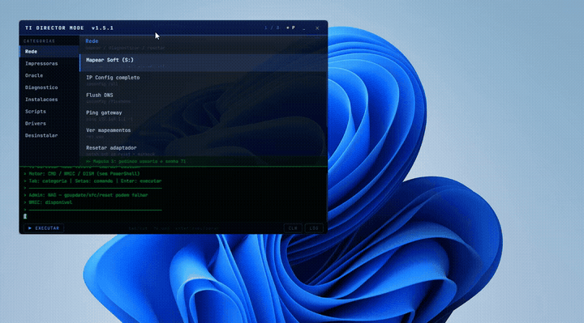
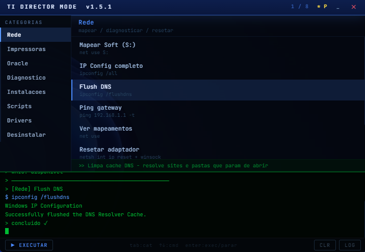
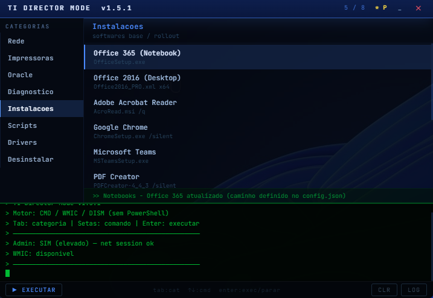
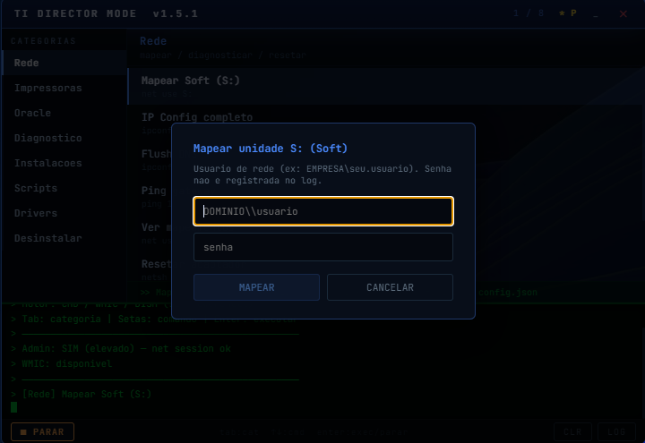
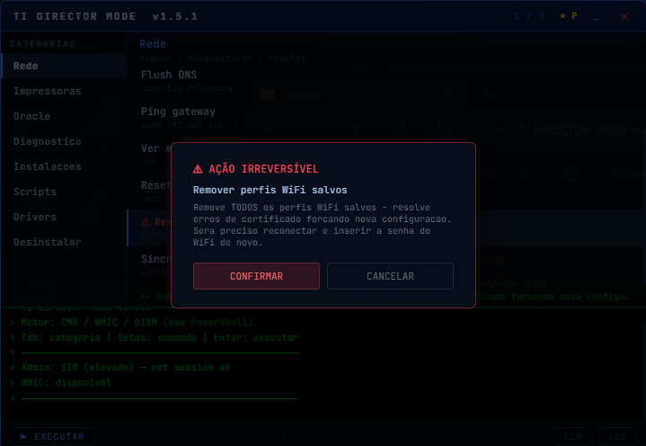

# TI Director Mode

> Overlay de suporte técnico para Windows corporativo — desenvolvido para ambientes com
> restrições de PowerShell, AppLocker e políticas de segurança corporativa.

<!-- GIF ou screenshot principal aqui -->


---

## Resultados

- Redução do tempo de preparação de máquina de ~15 para ~3 minutos
- Mais de 50 comandos de suporte centralizados em um único overlay
- Eliminação de execução manual de scripts recorrentes durante rollout
- Fallback automático para ambientes sem WMIC (Windows 11 22H2+)
- Credenciais de rede protegidas — senha nunca aparece em log ou terminal

---

## Por que existe

Analistas de suporte perdem tempo significativo em rollouts: mapear rede,
instalar software, coletar inventário, diagnosticar drivers. O TI Director Mode
centraliza tudo em um overlay flutuante que fica sobre qualquer janela enquanto
você atende — sem abrir CMD manualmente, sem decorar comandos, sem errar caminho
de instalador.

Origem: criado para uso interno em ambiente corporativo, evoluído para projeto
configurável por qualquer empresa de TI via `config.json`.

---

## Screenshots





---

## Tecnologias

| Camada | Tecnologia |
|--------|------------|
| Shell da aplicação | Electron 28 |
| Interface | React 18 + Vite 5 |
| Estilização | CSS Modules + glassmorphism nativo |
| Execução de comandos | Node.js `child_process` (spawn/exec) |
| Motor de comandos | Windows CMD (`cmd.exe`) |
| Inventário de hardware | WMIC / fallback `reg query` + `systeminfo` |
| Drivers | `pnputil /enum-devices /problem` |
| Instalação de features | DISM (`/add-capability`) |
| Mapeamento de rede | `net use` |
| Comunicação renderer ↔ main | Electron IPC com `contextBridge` |
| Build | `electron-builder` (portable `.exe`) |

---

## Segurança

- **Zero PowerShell** — apenas `cmd.exe` e ferramentas nativas Windows
  (`net`, `ipconfig`, `wmic`, `reg`, `netsh`, `pnputil`, `dism`)
- **Credenciais protegidas** — senha de rede inserida via modal, escrita em
  `.bat` temporário e deletada após uso; nunca aparece no log ou no terminal
- **IPC com contextIsolation** — renderer não acessa Node.js diretamente;
  toda comunicação passa pelo `preload.js` com `contextBridge`
- **Confirmação para ações destrutivas** — comandos marcados com `dangerous: true`
  exibem modal de confirmação antes de executar
- **Log auditável** — todas as execuções registradas em `C:\Suporte\TIDirectorMode.log`
  com timestamp, sem dados sensíveis

---

## Configuração

Duas formas de configurar, sem nunca precisar recompilar:

**1. Pela própria interface (recomendado)** — categoria **⚙ Configurações** no
app: edita os caminhos, testa se cada um existe, e salva. Vale no próximo
comando, sem reiniciar o app.

**2. Editando `config.json` direto** — mesmo arquivo, na raiz do projeto (dev)
ou ao lado do `.exe` (produção). Nesse caso, como o app carrega o arquivo uma
vez ao abrir, é preciso **reiniciar** para a mudança manual valer (só edições
feitas pela tela de Configurações aplicam na hora).

```json
{
  "company": { "name": "Minha Empresa" },
  "network": {
    "softServer":  "\\\\servidor\\soft",
    "softDrive":   "S:",
    "gateway":     "192.168.1.1",
    "wifiProfile": "CORP_WIFI"
  },
  "paths": {
    "office365": "\\\\servidor\\soft\\Office365\\setup.exe",
    "chrome":    "\\\\servidor\\soft\\Chrome\\ChromeSetup.exe"
  },
  "hostname": {
    "pattern":        "^[A-Za-z]{2}\\d{5}S$",
    "notebookPrefix": "NB"
  }
}
```

Lista completa de caminhos configuráveis: veja `config.json` na raiz do
projeto, ou a própria tela de Configurações no app.

Em produção, coloque o `config.json` na mesma pasta do `.exe`.

---

## Como rodar (desenvolvimento)

```bash
git clone https://github.com/Gabigol09/TI-DIRECTOR-MOD
cd TI-DIRECTOR-MOD
npm install
npm run dev
```

Requisitos: Node.js 18+ e Windows 10/11.

---

## Estrutura

```
ti-director/
  config.json               ← configuração editável (servidores, caminhos, hostname)
  src/
    main/
      main.js               ← janela Electron, IPC, atalho global
      preload.js            ← bridge segura renderer ↔ main
      configLoader.js       ← lê config.json com fallback para defaults
      corporatePaths.js     ← expõe caminhos do config para os scripts
      scripts.js            ← SCRIPT_MAPEAR_SOFT, SCRIPT_NOVA_MAQ, SCRIPT_INVENTARIO
      processRunner.js      ← execução CMD com stream, stop e track de processos
      adminCheck.js         ← verifica privilégio via net session
      wmicCheck.js          ← detecta disponibilidade do WMIC
    renderer/
      App.jsx
      components/           ← Header, Sidebar, CommandPanel, Terminal, WmicDialog
      styles/               ← CSS Modules por componente
    shared/
      commands.js           ← catálogo de 50+ comandos e categorias
      resolveCommand.js     ← aplica fallbacks WMIC automaticamente
```

---

## Atalhos

| Tecla | Ação |
|-------|------|
| `Ctrl+Shift+F1` | Mostrar / ocultar |
| `Tab` / `Shift+Tab` | Navegar categorias |
| `↑` `↓` | Navegar comandos |
| `Enter` | Executar |
| `_` | Minimizar para faixa do header |
| `P` | Fixar / soltar always on top |
| `✕` | Fechar |

A categoria **⚙ Configurações** (sidebar) foge desse padrão de propósito —
em vez de comandos, é um formulário pra editar os caminhos direto pela
interface (veja a seção Configuração abaixo).

---

## Scripts automáticos

| Script | O que faz |
|--------|-----------|
| **Mapear Soft (S:)** | `net use` com credenciais TI — senha não aparece no log |
| **Preparar máquina nova** | Detecta NB vs Desktop pelo hostname, mapeia rede e abre o instalador do Office correto |
| **Inventário do usuário** | Coleta Sobre o PC + Device ID + programas instalados e solicita print para evidência de rollout |

---

## Gerar o .exe portable

```bash
npm install
npm run build
```

Saída: `release/TI_DirectorMode_v1.7.0.exe` (~150–200 MB, runtime Electron incluso).

> Na primeira execução o Windows pode exibir aviso do SmartScreen por ser um app
> não assinado por certificado comercial.

---

## Histórico de versões

Ver [CHANGELOG.md](CHANGELOG.md).
